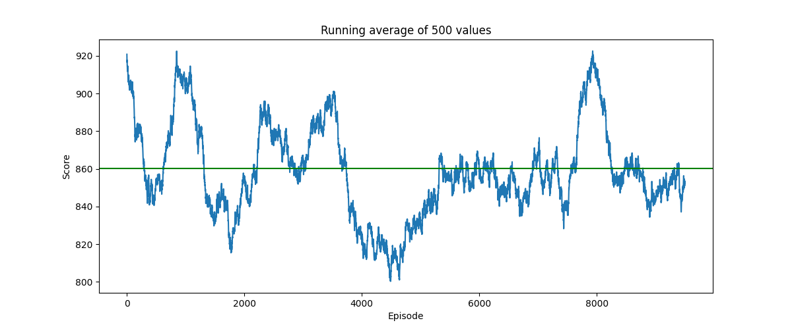
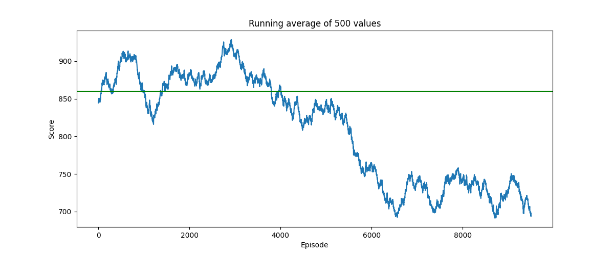

# 2048-RL
An approach to solving the 2048 game using reinforcement learning in the context of a coding challenge

About the challenge
---

The challenge is to implement the game logic and provide AI hints to the player if requested. Since adding some UI
on top of this game is quite straight forward, I decided to go for a simple command line interface. The actual challenge
is to provide meaningful AI hints for the player. A LLM is for sure the wrong tool for such a task as it does not 
require interpreting written instructions or to formulate out answers. Of course, an LLM could help with providing 
"human-readable" explanations for the suggestion, but that's an even more complex task to solve. The value of the AI is 
in providing one of four directions as "best next move". Studying the game shows that this is not a simple task as 
seemingly harmless moves can be devastating down the road. However, the game mechanics are so simple that I suspect a 
small decision tree would perform better and much more resource efficient than a more complex AI model. But that's not 
the challenge.

As for the AI model: Looks like a nice task to try out some reinforcement learning, but I do not have any prior 
experience in this field. I give it a go anyway, I am curious what I can learn.

Game engine
---

For the game engines implementation just the python standard library is used. Since the game logic is straightforward, 
and the state is small, this will be reasonably fast when running RL on it where I would expect the majority of time 
will be spent updating the model. This probably could have been solved much more elegantly using numpy or similar, but 
I wanted to keep it simple and therefore did not introduce additional dependencies for this (yet).

AI Model
---

Reading up about reinforcement learning it seems that Q-learning seems to be a good approach to try out as it's fairly
simple and the pattern `state` -> `action` -> `reward` -> `state` seems to fit the game well. But there is one problem:
regular Q-learning only works if that state space is "small" as the idea is to save all `states-actions-reward-state`
possibilities to then be able to find the best action for a given state. This is not the case for the 2048 game as the
state space is quite large. We got 16 fields, and each can have 17 different numbers (from 2^0 - 2^16), but since the 
highest number can only be in one field (as there is no space to create two of these tiles), the number of possible 
states is probably something along 17!. In reality it's a bit less because of symmetries, but it's anyway too much for
Q-learning. If we used 5 bit per cell and therefore 10 Byte (5*16/8) for saving one state, we would need ~3.5 PB of 
storage for all possible states alone (I'm ignoring symmetries and possible patterns we could exploit to reduce the 
amount of data).

Deep Q-learning (DQL) might help us out here: In DQL a neuronal network is used to approximate the function that 
predicts the best action for a given state. This network is trained by using a replay buffer to sample random batches
of experiences and then update the network parameters. I've mainly used these two resources to get started, but also 
"consumed" some other resources that I found less helpful:

- https://docs.pytorch.org/tutorials/intermediate/reinforcement_q_learning.html
- https://www.youtube.com/watch?v=EUrWGTCGzlA

I assume that the chosen network is very critical for the success of the training, but I do not have any experience in
designing such networks. I did not find a comprehensive guide in how to design such a network, this seems much 
problem-dependent. There are a lot of variables to consider, starting with how to represent the state in the network,
how to reward the agent and setting the right hyperparameters for the training. All seem to have some influence on
what kind of network to choose and vice versa... I do not really have the capacity to deep dive the topic at the moment
and will therefore just explore how far I can get with an empiric approach.

### Simulation with untrained network

I ran the training with an untrained network and no optimizing step (basically choosing a random direction for every
step) for 10'000 episodes. This gives a good baseline for how well random performs in 2048. My minimal goal for now is
to get a network that will perform just better than random. The run did not take long, so I think I can keep using the 
Python standard library instead of numpy for the engine.

- Min Score: 36
- Average Score: 860
- Max Score: 3184
- Min number of moves: 23
- Max number of moves: 3903
- Average number of moves: 426
- Max tile reached: 256

There is no significant change in the data as epsilon value gets smaller (smaller epsilon means that more actions are 
decided by the network instead of by the random generator). This basically means that the untrained network chooses 
randomly.

*The graph shows running average training score over 10'000 episodes of an untrained network without optimizing step
and the overall average score as a green line.*

### Training with network from Tutorial

If I train with the parameters and network used in the tutorial the network performs even worse than the random 
generator.

*The graph shows the running average training score over 10'000 episodes of the tutorial network and the average score 
of random moves as a green line.*

It somehow seems to make sense that this network won't work as the problem solved in the tutorial is quite different.
The physics in the cartpole simulation can be described in a few equations. While it's not easy to solve, there are 
strong correlations of inout and output that a network should be able to pick up (and in fact it does as the tutorial
proves). 2048 is very different, while the merging is a simple mechanic, it also has a random component with the 
spawning of new tiles.

### Training with network suggested in internet resources

As I have no experience in designing such a network, I searched for resources and found some that had success using
convolutional networks. It looks like the former might have inspired the latter.

- https://www.youtube.com/watch?v=qKAMUCQCInM
- https://medium.com/@qwert12500/playing-2048-with-deep-q-learning-with-pytorch-implementation-4313291efe61

Since both of the above sources state a higher mean random score, I investigated the cause of this. The explanation is 
simple: when spawning a new tile, I currently use a 50:50 chance of either 2 or 4, but the original game uses a ration 
of 9:1. With the adapted ratio, the scores look like the following:

How to use the provided code
---

A python environment with the dependencies listed in `requirements.txt` is required. For running the training on a GPU
a special, hardware/software-specific version of PyTorch is required. GPU is highly recommended for training. Follow 
the guide here:
https://pytorch.org/get-started/locally/

Afterward the "main.py" script can be used to run the training.
