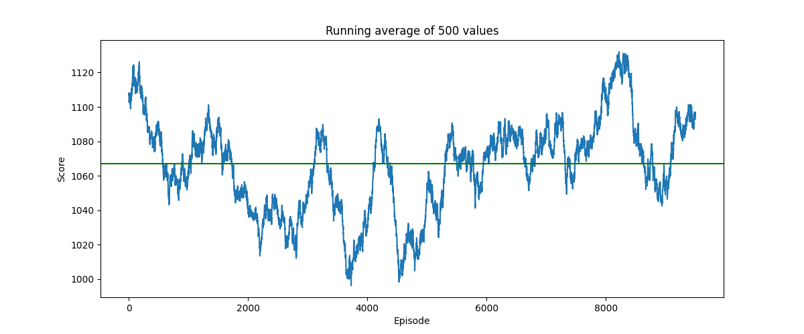
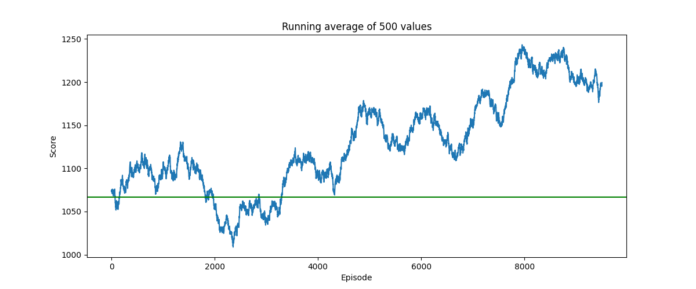
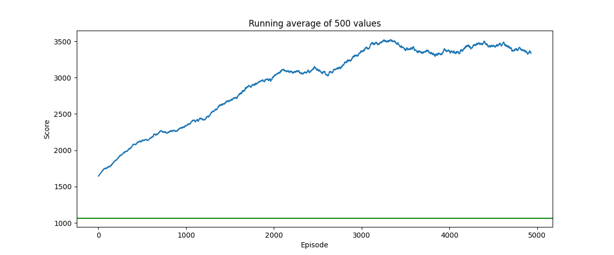
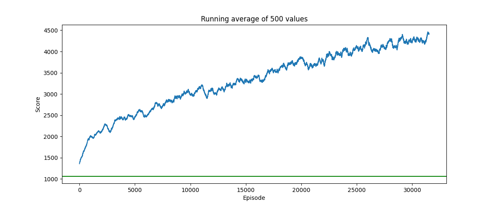

# 2048-RL
An approach to solving the 2048 game using reinforcement learning in the context of a coding challenge

About the challenge
---

The challenge is to implement the game logic and provide AI hints to the player if requested. Since adding some UI
on top of this game is quite straight forward, I decided to go for a simple command line interface. The actual challenge
is to provide meaningful AI hints for the player. A LLM is for sure the wrong tool for such a task as it does not 
require interpreting written instructions or to formulate out answers. Of course, an LLM could help with providing 
"human-readable" explanations for the suggestion, but that's an even more complex task to solve. The value of the AI is 
in providing one of four directions as "best next move". Studying the game shows that this is not a simple task as 
seemingly harmless moves can be devastating down the road. However, the game mechanics are so simple that I suspect a 
small decision tree would perform better and much more resource efficient than a more complex AI model. But that's not 
the challenge.

As for the AI model: Looks like a nice task to try out some reinforcement learning, but I do not have any prior 
experience in this field. I give it a go anyway, I am curious what I can learn.

Game engine
---

For the game engines implementation just the python standard library is used. Since the game logic is straightforward, 
and the state is small, this will be reasonably fast when running RL on it where I would expect the majority of time 
will be spent updating the model. This probably could have been solved much more elegantly using numpy or similar, but 
I wanted to keep it simple and therefore did not introduce additional dependencies for this (yet).

AI Model
---

Reading up about reinforcement learning it seems that Q-learning seems to be a good approach to try out as it's fairly
simple and the pattern `state` -> `action` -> `reward` -> `state` seems to fit the game well. But there is one problem:
regular Q-learning only works if that state space is "small" as the idea is to save all `states-actions-reward-state`
possibilities to then be able to find the best action for a given state. This is not the case for the 2048 game as the
state space is quite large. We got 16 fields, and each can have 17 different numbers (from 2^0 - 2^16), but since the 
highest number can only be in one field (as there is no space to create two of these tiles), the number of possible 
states is probably something along 17!. In reality it's a bit less because of symmetries, but it's anyway too much for
Q-learning. If we used 5 bit per cell and therefore 10 Byte (5*16/8) for saving one state, we would need ~3.5 PB of 
storage for all possible states alone (I'm ignoring symmetries and possible patterns we could exploit to reduce the 
amount of data).

Deep Q-learning (DQL) might help us out here: In DQL a neuronal network is used to approximate the function that 
predicts the best action for a given state. This network is trained by using a replay buffer to sample random batches
of experiences and then update the network parameters. I've mainly used these two resources to get started, but also 
"consumed" some other resources that I found less helpful:

- https://docs.pytorch.org/tutorials/intermediate/reinforcement_q_learning.html
- https://www.youtube.com/watch?v=EUrWGTCGzlA

I assume that the chosen network is very critical for the success of the training, but I do not have any experience in
designing such networks. I did not find a comprehensive guide in how to design such a network, this seems much 
problem-dependent. There are a lot of variables to consider, starting with how to represent the state in the network,
how to reward the agent and setting the right hyperparameters for the training. All seem to have some influence on
what kind of network to choose and vice versa... I do not really have the capacity to deep dive the topic at the moment
and will therefore just explore how far I can get with an empiric approach.

### Simulation with untrained network

I ran the training with an untrained network and no optimizing step (basically choosing a random direction for every
step) for 10'000 episodes. This gives a good baseline for how well random performs in 2048. My minimal goal for now is
to get a network that will perform just better than random. The run did not take long, so I think I can keep using the 
Python standard library instead of numpy for the engine.

- Min Score: 36
- Average Score: 860
- Max Score: 3184
- Min number of moves: 23
- Max number of moves: 3903
- Average number of moves: 426
- Max tile reached: 256

There is no significant change in the data as epsilon value gets smaller (smaller epsilon means that more actions are 
decided by the network instead of by the random generator). This basically means that the untrained network chooses 
randomly.

*The graph shows running average training score over 10'000 episodes of an untrained network without optimizing step
and the overall average score as a green line.*

### Training with network from Tutorial

If I train with the parameters and network used in the tutorial the network performs even worse than the random 
generator.

*The graph shows the running average training score over 10'000 episodes of the tutorial network and the average score 
of random moves as a green line.*

It somehow seems to make sense that this network won't work as the problem solved in the tutorial is quite different.
The physics in the cartpole simulation can be described in a few equations. While it's not easy to solve, there are 
strong correlations of inout and output that a network should be able to pick up (and in fact it does as the tutorial
proves). 2048 is very different, while the merging is a simple mechanic, it also has a random component with the 
spawning of new tiles.

### Training with network suggested in internet resources

Since I have no experience in designing a suitable network, and this domain is complex and vast, for sure way too vast 
for the scope of this project, I searched for resources specific for 2048. I found some that had success using convolutional 
networks. It looks like the former might have inspired the latter.

- https://www.youtube.com/watch?v=qKAMUCQCInM
- https://medium.com/@qwert12500/playing-2048-with-deep-q-learning-with-pytorch-implementation-4313291efe61

Since both of the above sources state a higher mean random score, I investigated the cause of this. The explanation is 
simple: when spawning a new tile, I currently use a 50:50 chance of either 2 or 4, but the original game uses a ratio 
of 9:1. With the adapted ratio, the scores look like the following:

#### Random baseline with 9:1 spawn ratio

*The graph shows running average training score over 10'000 episodes of an untrained network without optimizing step
and the overall average score as a green line. The spawn ratio of 2/4 values is 9:1 instead of 1:1.*

- Min Score: 112
- Average Score: 1067
- Max Score: 4700
- Min number of moves: 44
- Max number of moves: 5486
- Average number of moves: 561
- Max tile reached: 512

The training with the tutorial network showed, as expected, the same effect as described above.

#### Adaptions made based on the Medium post

I introduced a few changes to the trainer inspired by the Medium post:

- Penalties for moves that do not change the state. As we can see in the data from the tutorial network, one thing that  
  it seems to do is to repeat the same move over and over again. This will just generate a lot of useless training data
  and might in fact be the reason for the decay in average score, below the random baseline.
- Penalties for reaching game-over. This seems undesirable. I should introduce this individually and check how this 
  impacts the training. But I do not have the time to do so now.
- In the Medium post the optimizer runs for 100 times using small batches (of 64 elements) for each episode. With a 
  replay buffer size of 50k elements, this seems to be a tiny batch size. I suspect it's faster to do fewer optimization
  steps but bigger batches as it means fewer switches from CPU to GPU, so I went with some middle ground.

With these adaptions I first re-trained the Tutorial network and, as expected, it actually improved the outcome 
significantly. Note: Running the training multiple times results in very different outcomes. Most looked similar to the
graph below, but one showed the same problem as stated above where it got worse than random over time.

*The graph shows the running average training score over 10'000 episodes of the tutorial network with the adapted 
training procedure described above. The average score of random moves is represented as a horizontal green line.*

#### Training the network

I've trained the suggested network with almost identical training parameters (except a bigger batch size) for about 5000
episodes (aborting the training after about 16h due to time constraints). The training results look quite promising.
I am not sure why it did plateau towards the end, it might just be a coincidence, although I would expect it to do so at
some point.

*The graph shows the running average training score over 5'500 episodes of the convolutional network suggested in the
Medium blog post. The average score of random moves is represented as a horizontal green line.*

Letting the model play the game for 1000 rounds resulted in the following data:

- Min Score: 548
- Average Score: 3816
- Max Score: 13400
- Min number of moves: 66
- Max number of moves: 9105
- Average number of moves: 311
- Max tile reached: 1024

The biggest problem with this model is the size of the network. Its state is 380 MB large, which is quite a lot for a
network playing 2048. The size also affects the training time considerably.

#### Optimizing the network

I've reduced the model size quite a bit, in addition, now with the much smaller model size, I can easily increase the
batch size for training. In the hope to positively affect training speed, I have also reduced the replay memory size.
A large replay memory is needed if a network is in danger of "unlearning" previously learned behavior. Since each 
episode starts from scratch and the number of average total moves is still much smaller than the replay memory, it seems
to make sense to reduce its size. For this model I also refrain from training with spawning of new numbers. The model 
will therefore only learn from the predictable state transitions. The model never sees the random game element. I don't 
think that the randomness has a big impact on selecting the best next move, so the hope is to achieve better results by 
not "confusing" the model.

The training results look very nice, and the size of the network is, with 32MB, considerably smaller. This network did
not plateau yet, but I didn't take the time to train it for longer (yet).

*The graph shows the running average training score over 32k episodes of the small convolutional network. The average 
score of random moves is represented as a horizontal green line.*

Letting the model play the game for 1000 rounds resulted in the following data:

- Min Score: 548
- Average Score: 4080
- Max Score: 12808
- Min number of moves: 72
- Max number of moves: 1623
- Average number of moves: 331
- Max tile reached: 1024

The results look very similar to the bigger model and were reached with the same amount of training time. But the model
is 10x smaller, and it seems to be much less prone to suggest "useless" moves. I also played a game with hints from this
model, and it's interesting to see what it suggests. For sure, the tactic it learned is different from mine.

Outlook
---

I think the network can still be improved quite a lot. For one, because there are many RL techniques out there that 
could be explored but especially because the game follows very specific rules that can be considered. In the end we do 
not need to find a model that predicts the whole game but that can be used to solve the game. Investing in understanding
the domain and how this can be leveraged in RL is probably the best way forward. Supervised learning would be
interesting to explore.

As for the code itself: There are a lot of areas which need improvement:
- Training speed is one limiting factor in finding a good solution. Adding some tracing to find bottlenecks would be 
  helpful. For sure, running the game logic is consuming more time than I expected. As the model gets better, the impact
  of this grows as more and more moves are executed per episode. Re-implementing this with execution speed in mind would
  be a good idea.
- The trainer class keeps way too much state which makes testing super hard. I would suggest refactoring this to make 
  it more testable and reusable. Lots of testing is missing.
- Some of the trainers' parameters are not configurable and therefore not in the saved metadata.
- The trainer needs proper stop/resume functionality and error handling.
- The progress tracker lacks some data: timestamps would be useful...
- There is a warning about the padding in the convolutional network that needs to be investigated.

And of course the user experience is horrifying, so a proper UI would be nice ;-)

How to use the provided code
---

A python environment with the dependencies listed in `requirements.txt` is required. For running the training on a GPU
a special, hardware/software-specific version of PyTorch is required. GPU is highly recommended for training. Follow 
the guide here:
https://pytorch.org/get-started/locally/

Use the "train.py" script to run the training and the "play.py" script for playing the game on the commandline.
